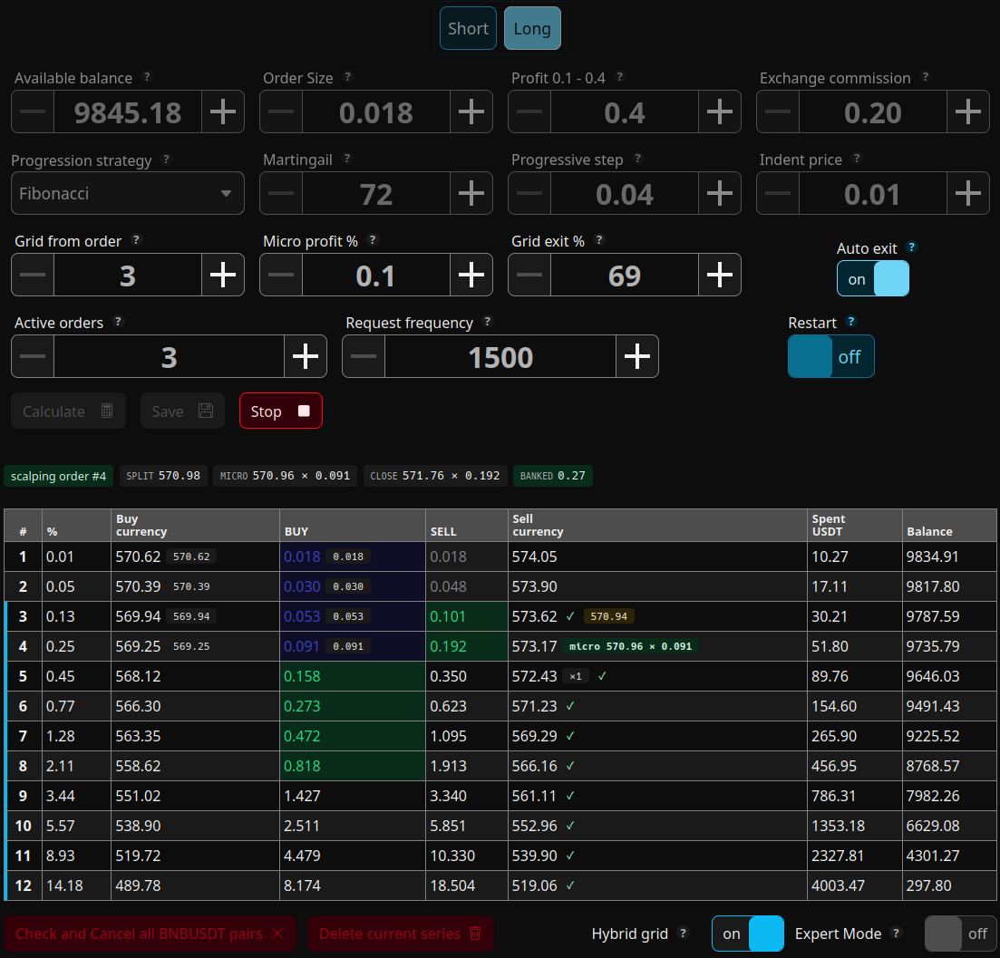

# Spot Trading Bot for Binance



> **Canonical repository:** GitLab — development, issues, merge requests, and releases happen there.  
> **GitHub:** read-only mirror for visibility and easier discovery.

Self-hosted spot trading bot for Binance with a web dashboard.
Runs with **your own** API keys, defaults to **testnet**, and stores its state locally.

- **GitLab (canonical):** <https://gitlab.com/AndreyPopov/spot-trading-bot>
- **GitHub mirror:** <https://github.com/PopovAndrii/spot-trading-bot>
- **Documentation site:** <https://exchange-crypto-059f74.gitlab.io/>
- **Documentation sources:** VitePress docs in `docs/`

## Quick start

You need **Docker with Compose v2**.

1. Create a working directory and save `compose.public.yml` there as `compose.yml`.
2. Create a writable data directory:

```sh
mkdir -p data
```

3. Generate your `.env` interactively:

```sh
docker compose run --rm -v "$PWD":/out -e ENV_OUT=/out/.env app npm run setup-user
```

4. Start the bot:

```sh
docker compose up -d
```

5. Open `http://localhost:3002` and log in with the credentials from step 3.

## Everyday commands

```sh
docker compose pull && docker compose up -d   # update
docker compose logs -f                        # follow logs
docker compose down                           # stop
```

## Safety notes

- Start on **Binance testnet** first.
- If `BINANCE_MODE=real` but no real keys are configured, the bot safely falls back to **testnet**.
- Do **not** run the same pair in both directions at once on one account
  (for example `BTCUSDC` Long and `BTCUSDC` Short simultaneously). Some destructive
  actions work on the **whole symbol**, so a cancel operation may affect both sides.
- This project is still **in testing**. It is provided **as is**, with **no warranty**,
  and the author accepts **no responsibility** for losses, damages, or trading results.

## Documentation

- User / operator docs: `docs/`
- Getting started: `docs/guide/getting-started.md`
- Testnet vs real: `docs/guide/testnet-vs-real.md`
- Running & persistence: `docs/operations/running.md`
- Developer notes: `docs/developer/for-developers.md`
- Disclaimer: `docs/help/disclaimer.md`

## License

**Copyright © 2026 Andrii Popov.**

Released under the **GNU General Public License v3.0 or later** (GPLv3). See `LICENSE`.

## Disclaimer

This software is an **independent, unofficial** project, not affiliated with Binance.
It is a tool, **not financial advice**.

By using it, you accept that:

- live trading is done at your own risk;
- the software may contain bugs;
- the author and contributors accept **no liability** for financial loss or damages.
